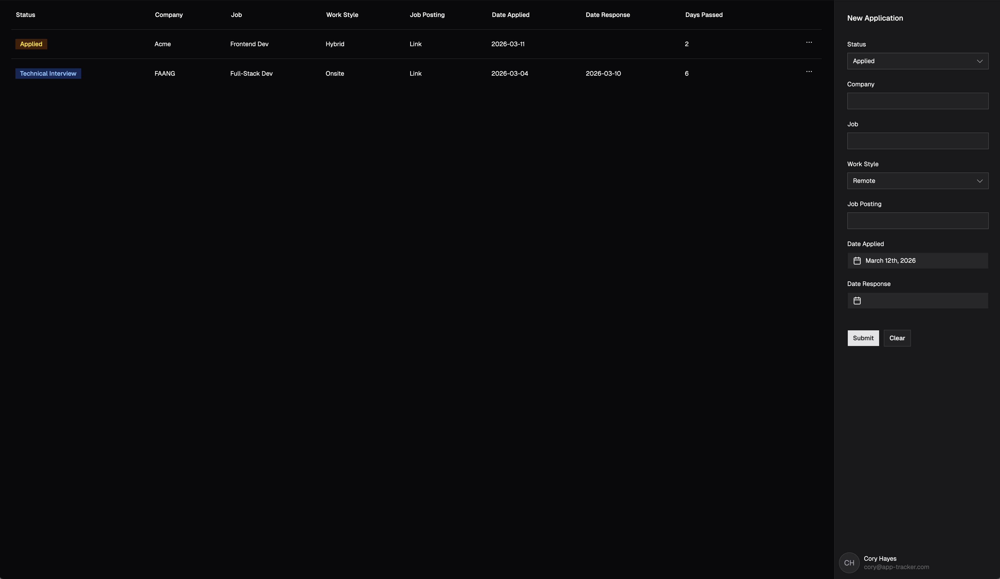

# Application Tracker
A full-stack job application management tool that helps you track, organize, and monitor your job applications through every stage of the hiring pipeline.

**[Live Demo](#)** | **[Features](#features)** | **[Tech Stack](#tech-stack)** | **[Getting Started](#getting-started)**

## Overview
Applying for jobs is a numbers game, and keeping track of where you are in each pipeline can be overwhelming. **Application Tracker** consolidates all your job applications in one searchable, sortable dashboard—so you can focus on what matters: landing your next role.

Whether you're applying to 5 companies or 50, this tool helps you:
- Track application status from initial submission to offer/rejection
- Monitor key dates (applied, response received)
- Organize by company, role, work style, and status
- Get quick insights with visual status badges and elapsed time counters

## Features
- 🎯 **Full CRUD Operations** - Add, view, edit, and delete job applications
- 📊 **Status Pipeline** - Track applications through 7 stages: Applied, Recruiter Screen, Technical Interview, Final Interview, Offer, Rejected, Withdrawn
- 🔍 **Sortable & Searchable** - Sort by any column to quickly find applications
- ⏱️ **Days Elapsed Counter** - Automatically calculate how long each application has been pending
- 🎨 **Dark Mode Support** - Toggle between light and dark themes
- 📱 **Responsive Design** - Works seamlessly on desktop and mobile
- ⚡ **Real-time Updates** - Changes sync instantly across the app with React Query
- 🎪 **Polished UX** - Toast notifications, confirmation dialogs, and smooth interactions

## Tech Stack
### Frontend
- **React 19** - Modern UI rendering with Hooks
- **Vite** - Lightning-fast build tool and dev server
- **TanStack Form** - Type-safe form management
- **TanStack Table (React Table)** - Headless table component with sorting and filtering
- **Tailwind CSS** - Utility-first styling
- **shadcn/ui** - High-quality, accessible UI components
- **React Query** - Server state management and data synchronization
- **Zod** - TypeScript-first schema validation

### Backend
- **Hono** - Lightweight web framework for Cloudflare Workers
- **Drizzle ORM** - Type-safe database ORM
- **PostgreSQL** - Relational database (hosted on Neon)

### Infrastructure
- **Cloudflare Workers** - Serverless edge computing
- **Neon** - Postgres database hosting

## Project Structure
src/
├── app/              # Main app component and initialization
├── components/
│   ├── sidebar/      # Form and application creation UI
│   ├── table/        # Data table, columns, and actions
│   └── ui/           # Reusable shadcn/ui components
├── hooks/            # Custom React hooks
├── types/            # TypeScript type definitions
├── api/              # Backend routes and handlers
└── db/               # Database schema and migrations

##Learning & Development
This project showcases:
- **Modern React Patterns** – Hooks, context, and state management
- **Type-Safe Development** – Comprehensive TypeScript usage from frontend to backend
- **Form Handling** – Complex form validation and state management
- **API Design** – RESTful API built with Hono
- **Database Management** – Schema design and migrations with Drizzle ORM
- **Responsive UI** – Tailwind CSS and accessible components
- **Deployment** – Serverless architecture with Cloudflare Workers
- 
### License
This project is open source and available under the MIT License.
